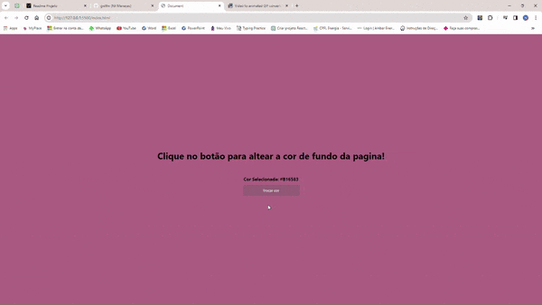

# Altera cor do backgrond

<p align="center">

  

  
</p>

https://github.com/gnilfm/altera-cor-backgrond/assets/108699665/d97abeb2-664a-4d53-98a6-655b953b95f7

## 🤔 O que é este projeto
Este é um projeto simples, uma página feita com HTML, CSS, e javaScript que contem um texto e um boão e ao clicar nesse botão a cor do backgrond da página sera alterada aleatoriamente e sera exibio o nome da cor em hexadecimal.

## 💻 Como rodar este projeto
- Para rodar o projeto basta navegar ate o diretorio onde seu arquivo esta salvo no sistema operacional abrir o diretotrio e localizar o arquivo index.html clicar sobre ele e o projeto sera aberto em seu navegador

- Alternativamente utilizar a extensação [Live Server](https://marketplace.visualstudio.com/items?itemName=ritwickdey.LiveServer) da IDE Visual studio code clicar com o botao direito do mouse e selecionar a opção open whit live server e o projeto sera aberto em seu navegador.

## 🕹️ Como usar este projeto
Basta clicar no botão <button>*Trocar cor*</button>   e a cor do background sera alterada, também o nome da cor sera exibido.

## ⚙️ Tecnologias usadas no projeto


## 🗒️ Features do projeto

- Botão que altera a cor do background da pagina.
- Area que exibe o nome da cor em hexadecimal.

## 📁 Como o projeto esta organizado

Na pasta raiz do projeto existem 3 aquivos de código:
- index.html -> contém o html da aplicação
- style.css -> Contém os estilos da aplicação
- script.js -> Contém o codigo de JavaScript da aplicação

## 🧑‍💻 Como este projeto foi implementado

Ao clicar no botão, é disparado um evento que ira chamar uma função que vai alterar a cor de fundo da pagia e axibir o nome daquela cor em hexadecimal.

No JavaScript o botão definido em HTML e tem um evento onclick que recebe uma função ```trocarCorFundo()```, essa funcao recebe outra funcao ```getRandomColor()``` que gera cores aleatorias e retorna uma cor.

## 🌟 Dependências

Não temos dependências no projeto.

## 💎 Links Úteis
[Tags tecnologias(Badges4-README.md-Profile)](https://github.com/alexandresanlim/Badges4-README.md-Profile#-languages-)
[emoji-cheat-sheet](https://github.com/ikatyang/emoji-cheat-sheet/blob/master/README.md)

## 🤝 Como cotribuir com o projeto

[clique aqui](./CONTRIBUTING.md) para ver as diretrizes de contribuição.

## 👨‍💻 Pessoas que contribuiram com o projeto

[Nil](https://github.com/gnilfm) - Mantenedor do projeto

## 🆘 Preicsa de ajuda?
Você pode contatar Nil (mantenedor do projeto) no email: m.nil@live.com
